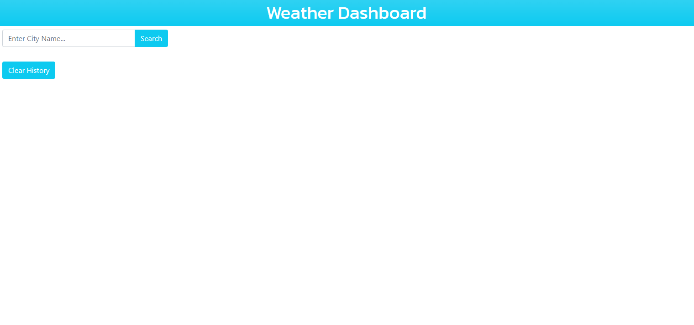
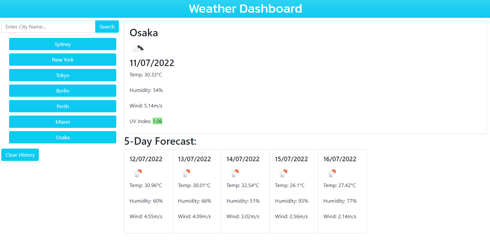

<h1>Weather Dashboard</h1>

<h2>Description</h2>
This project was built so that users can check the weather of their desired cities. It also has a search history, which lists previously searched cities and view the weather for those cities again later when clicked.

<h2>How to Run the Application</h2>
You can run the application by clicking this <a href="https://ghassanalassadi.github.io/weather-dashboard/">link</a>.

<h2>Screenshot</h2>

